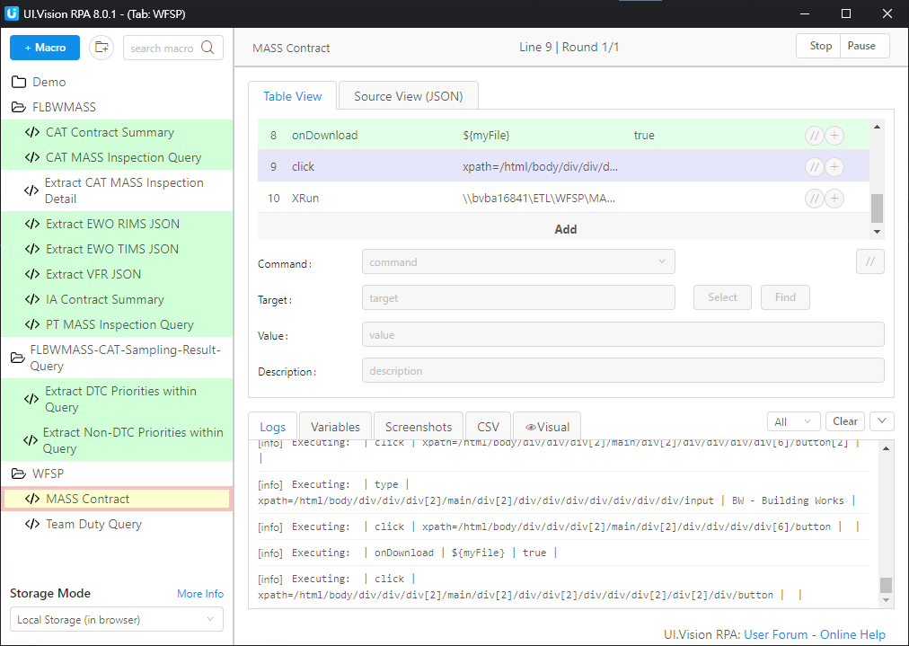

# e-Housing Scraper in UI.Vision

Macros to download files from [e-Housing](https://ehousing.int.housingauthority.gov.hk). They are implemented in [UI.Vision](https://ui.vision/).

1. A macro lands on a specific page.
2. It traces HTML elements to locate target files or pages.
3. Tweak parameters. Some of them are hard-coded.
4. Run in browser.

Not the most scalable solution, these macros are still faster than pulling data by hand. **It's super fast to add or change macros**.

Installation
---------------

First, install [UI.Vision browser extension](https://chrome.google.com/webstore/detail/uivision-rpa/gcbalfbdmfieckjlnblleoemohcganoc). Chrome is most recommended. See installation, config and how-to-use instructions in [official page](https://ui.vision/rpa/docs).

Free version of UI.Vision stores user's macros inside web browser. Download the macros :

    # Clone this repository
    $ git clone https://github.com/tc-ying/UI.Vision-ehousing-scraper 

Import `.json` files under `/macros` within UI.Vision extension. 

I tested the Macros on Chrome version 104.0 and UI.Vision version 8.0.1.

Usage
---------------

Tweak parameters once in a while. Sometimes they could be search query parameters :

    # Therefore update this monthly
    {
      "Command": "store",
      "Target": "202209",
      "Value": "myPeriod",
      "Description": "Period parameter"
    },

File names are also subject to change :

    {
      "Command": "store",
      "Target": "MASS Contract (Discipline BW - Building Works).xlsx",
      "Value": "myFile",
      "Description": "Filename parameter"
    },
    {
      "Command": "onDownload",
      "Target": "${myFile}",
      "Value": "true",
      "Description": ""
    },

License
---------------

This project is licensed under Mozilla Public License, Version 2.0. See LICENSE for full license text.

**Disclaimer : Contributors have agreed to submit no sensitive information to this repository for any purpose.**
